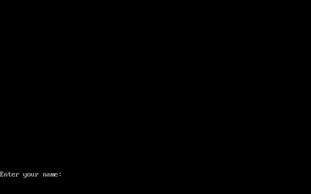
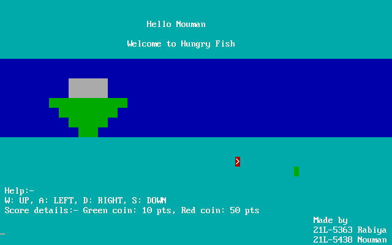
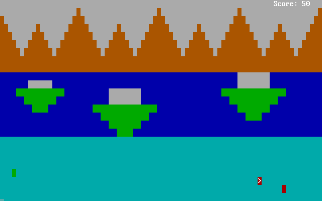
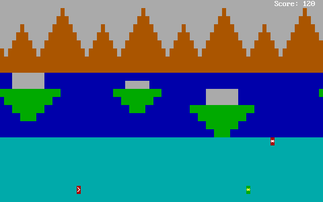
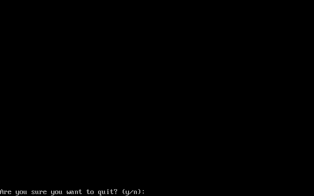

# Hungry-Fish-Assembly

## Built-with
- Assembly Langauge x86. 16-bit architecture.

## How to run
1. Extract nasm where you want to, or just use the `Hungry FIsh/game/` folder directly for nasm to work.
2. Open cmd (windows) and change directory to the game folder.
3. Assemble the `game.asm` file by typing `nasm game.asm -o game.com`.
4. Open DOSBox-0.74-3 folder and then `DOSBox 0.74-3 Options` file as text document.
5. Go to the end of the file and change mount commands arguments as per your local location of the game.
6. Open DOSBox and type `game.com` to run the game.

Note: If the `game.com` was not found, assemble properly and also be sure to check the mount location if it is correct.

## How to play the game
- Initially, you will have to type the name and press `Enter` to enter the game.
- Press `Enter` again on the home page after some wait.
- The player is a fish indicated by the angled bracket.
- The player can collect colored coins indicated by `green` and `red` flashing boxes.
- Red coin holds 50 score and green coin holds 10 score.
- Both coins disappear after some time. Red coin has less timer than green coin.
  
## Controls

Movements:
- W: Up
- S: Down
- D: Right
- L: Left

To quit the game:
- Press `ESC` and then type `y`. The game will immediately.

## Screenshots

### Login by Name

### Home Page

### In game shots

### Quit

